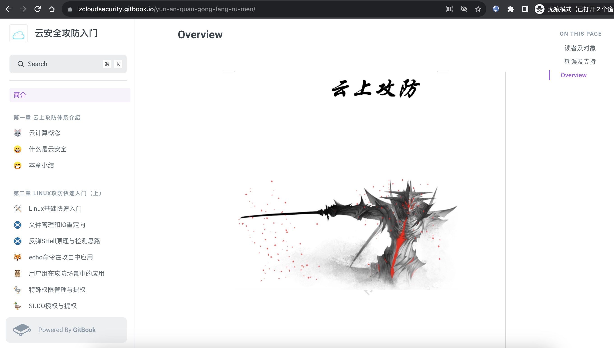

# lzCloudSecurity
《云安全攻防入门》教材

这本书原本是我为内部学员编写的，但不幸被一些别有用心的人扫描和售卖。 
所以我决定将它公开，虽然这本书的质量不高，但对于初学者来说，还是可以作为入门教材。 
这本书的内容由2021年形成，当时还没有形成体系，都是我以往在互联网所学习到的资料并且实战总结归类。 

阅读地址：https://lzcloudsecurity.gitbook.io/

## 读者及对象
适用于初中级安全从业人员，乙方安全测试，甲方安全自检，网络安全爱好者等，企业安全防护与提高。

## 勘误及支持
文中难免出现笔误或者不对的地方，请大家多多包涵，提前向各位说声对不起。由于 Gitbook 正在逐步完善中，为此带来的不便请您谅解！对于存在的问题，无论是内容上的不足亦或是项目的不足，欢迎大家提交 Issues
